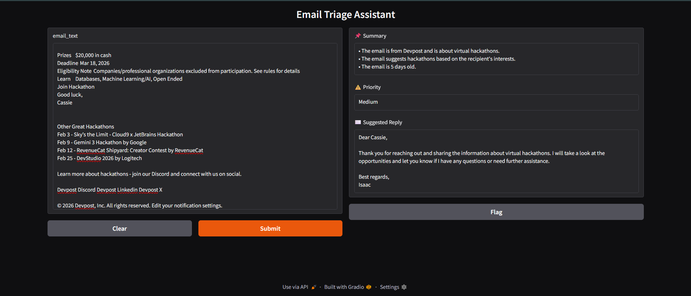

# Email Triage Assistant

An intelligent email analysis tool powered by Groq LLM and ScaleDown API that automatically summarizes, prioritizes, and suggests replies for your emails.

## Preview



## Features

- **Email Compression**: Condenses email content while preserving key information using ScaleDown API
- **AI-Powered Analysis**: Leverages Groq's Llama 3.1 model for intelligent email analysis
- **Smart Summarization**: Generates 2-3 concise bullet points from email content
- **Priority Classification**: Automatically classifies emails as High, Medium, or Low priority
- **Auto Reply Suggestions**: Creates professional, contextual reply suggestions
- **Web Interface**: Easy-to-use Gradio interface for seamless interaction

## Requirements

- Python 3.8+
- API Keys:
  - Groq API Key (https://console.groq.com)
  - ScaleDown API Key (https://scaledown.xyz)

## Installation

1. Clone or download the project
2. Install dependencies:

   ```bash
   pip install -r requirements.txt
   ```

3. Create a `.env` file in the project root with your API keys:
   ```
   GROQ_API_KEY=your_groq_api_key_here
   SCALEDOWN_API_KEY=your_scaledown_api_key_here
   ```

## Usage

Run the application:

```bash
python app.py
```

The Gradio interface will launch in your browser .

### Steps to Triage an Email:

1. Paste your email (or thread) into the text box
2. The app will automatically:
   - Compress the email content
   - Analyze it with AI
   - Extract summary, priority level, and suggested reply
3. Review the outputs and use the suggestions as needed

## How It Works

1. **Compression Phase**: The ScaleDown API compresses the email while maintaining critical information
2. **Analysis Phase**: Groq's Llama 3.1 model analyzes the compressed email
3. **Parsing Phase**: The response is parsed into three structured outputs:
   - **Summary**: Key bullet points
   - **Priority**: Classification (High/Medium/Low)
   - **Suggested Reply**: Draft response matching the urgency

## Dependencies

| Library         | Purpose                           |
| --------------- | --------------------------------- |
| `gradio`        | Web interface for the application |
| `requests`      | HTTP requests to ScaleDown API    |
| `python-dotenv` | Environment variable management   |
| `groq`          | Groq LLM API client               |

## Error Handling

The application includes error handling for:

- Empty email input
- API failures from ScaleDown
- LLM processing errors
- Parsing failures

Errors are displayed clearly in the UI for troubleshooting.

## Architecture

- **Input**: Email text via Gradio textbox
- **Processing**: Three-stage pipeline (compress → analyze → parse)
- **Output**: Summary, Priority level, and Suggested reply
- **UI Framework**: Gradio for interactive web interface

## Performance Notes

- Compression rate is set to "auto" for adaptive optimization
- LLM temperature is set to 0.3 for consistent, professional outputs
- Processing time depends on email length and API response times

## License

Unlicensed - Customize as needed for your project

## Support

For issues with:

- **Groq API**: Visit https://console.groq.com
- **ScaleDown API**: Visit https://scaledown.xyz
- **Gradio**: Visit https://gradio.app

---

**Last Updated**: February 2026
